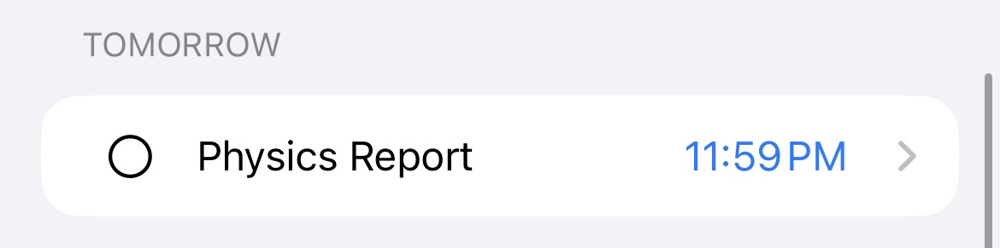
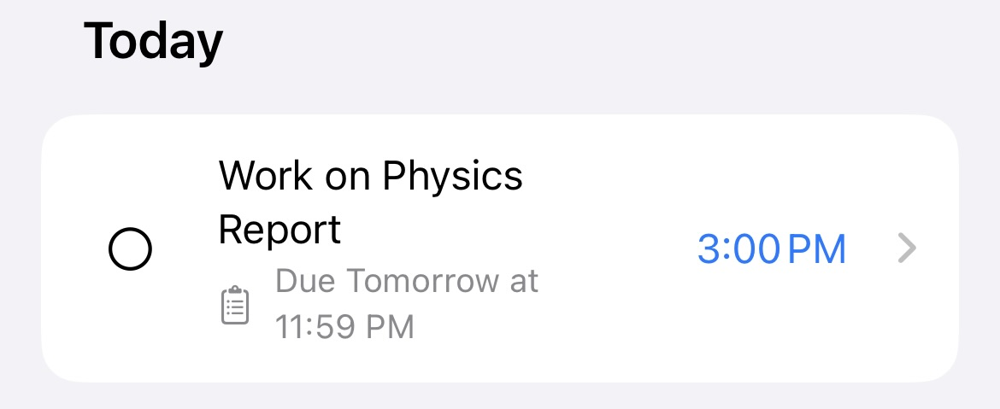
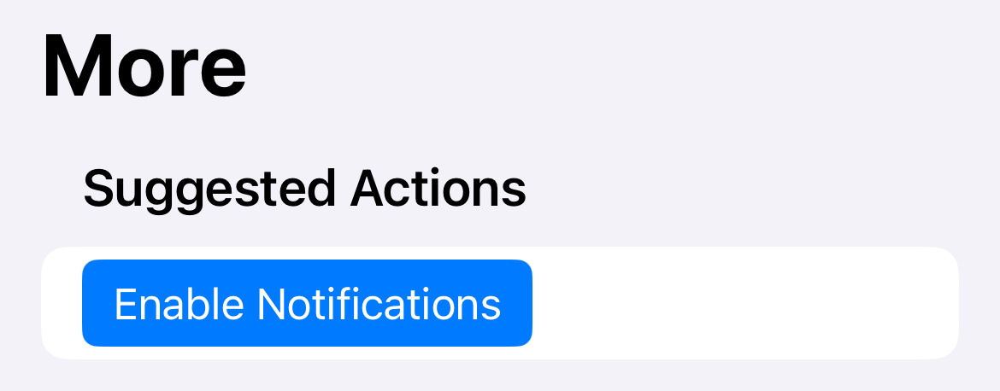

# Onboarding Guide

## Sync Tasks to Task Forge

Sync via Canvas (Recommended)


[sync-tasks-from-canvas.md](sync-tasks-from-canvas.md)


Sync via Google Calendar


[sync-tasks-from-google-calendar.md](sync-tasks-from-google-calendar.md)


## Tasks

Your Canvas assignments or Calendar events are automatically **made into tasks.**

<figure><figcaption></figcaption></figure>

Reminders will be made **automatically** for each task.

<figure><figcaption></figcaption></figure>

## Reminders

Reminders will be sent as a notification.

<figure><figcaption></figcaption></figure>

When all reminders for a task are complete, **the task is complete.**


Reminders are the primary tool you should use and work from.


## Notifications

**Enable notifications** for reminders to work properly.

Notifications are not enabled if the _"Enable Notifications"_ button appears in the _More_ tab under _Suggested Actions_.

<figure><figcaption></figcaption></figure>


Long press on notifications to use quick actions

\



## You are now all set up to use Task Forge!

Provide feedback on improvements for the app at the link below:



