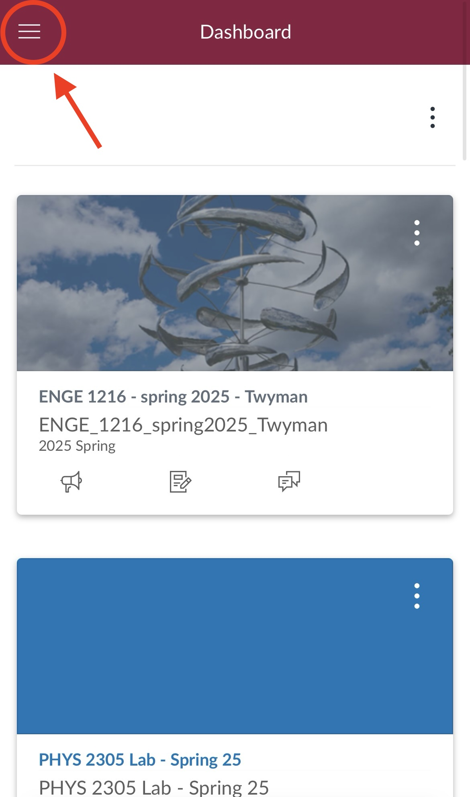
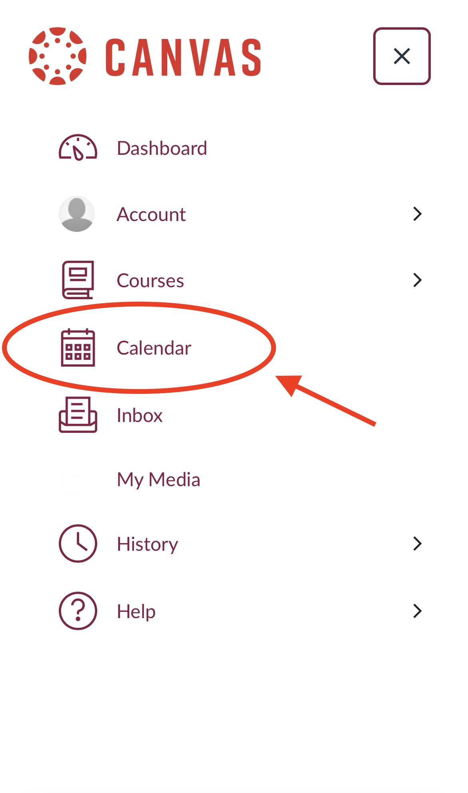
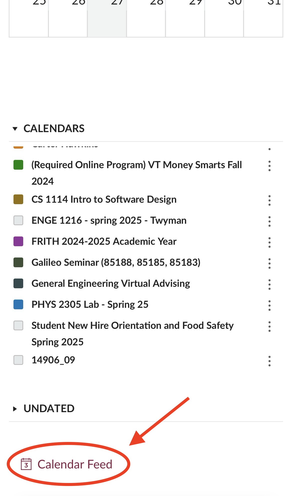

# Sync Tasks from Canvas

Follow directions on your phone:

Navigate to your Canvas home page&#x20;

Click on the Hamburger menu icon

<figure><figcaption></figcaption></figure>

Click the _Calendar_ tab

<figure><figcaption></figcaption></figure>

Scroll down and click _Calendar Feed_

<figure><figcaption></figcaption></figure>

Copy the URL Link

\*Make sure to select the entire URL!!

<figure><figcaption></figcaption></figure>

In the More tab, navigate to the _Syncing_ section and select _Add Canvas or Calendar Connection._ Paste the link into the _Add .ICS Link_ field.

<figure><figcaption></figcaption></figure>

